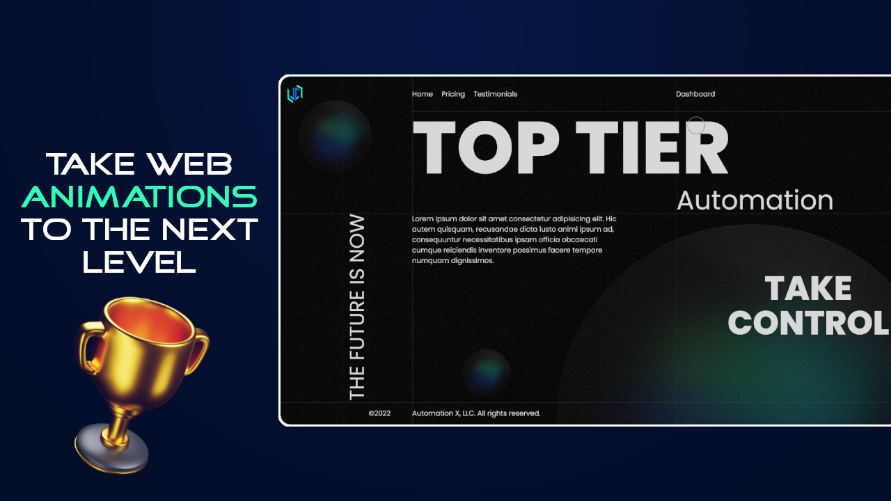

### How to build a website with animations like a pro using HTML, CSS & JavaScript 
##### [Watch the tutorial on YouTube]([https://youtu.be/oBKs1ef0LzI](https://youtu.be/WjpDbn-IsFk))
- Mobile first responsive design
- Utilize grid to create layouts
- Utilize flexbox to align elements
- CSS and JavaScript animations

